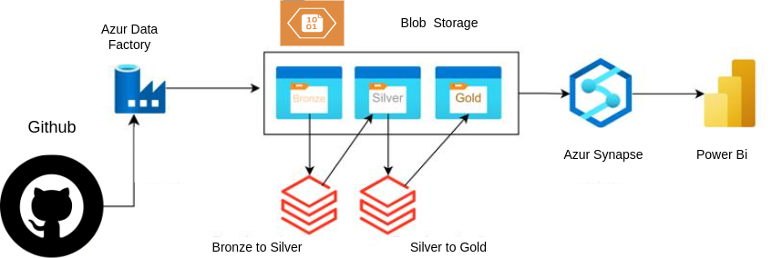

# COVID-19 Data Pipeline sur Azure

## Description
Dans le contexte de la pandémie de COVID-19, hôpitaux et autorités de santé publique doivent réagir rapidement pour gérer les ressources et adapter les mesures sanitaires. Cependant, la diversité et le volume des données disponibles compliquent leur exploitation.
Ce projet a pour objectif de mettre en place une solution Cloud complète pour collecter, traiter et analyser les données COVID-19. En centralisant ces informations, cette solution permettra aux équipes Data Analysts de créer facilement rapports et tableaux de bord afin d’appuyer des décisions éclairées.

---

## Prérequis

### Services Cloud
- **Compte Azure** : Pour accéder aux services suivants :
  - **Azure Data Factory** : Création de pipelines d’ingestion de données.
  - **Azure Databricks** : Création de clusters et exécution de notebooks PySpark.
  - **Azure Synapse Analytics** : Création de Data Warehouses et exécution de requêtes SQL.
  - **Azure Blob Storage** : Stockage des données brutes et transformées.
  - **Power BI** : Connexion à Synapse pour la visualisation des données.

### Langages et Outils
- **Python & PySpark** : Développement de scripts de traitement et manipulation de données volumineuses.
- **SQL pour Synapse** : Interrogation et analyse de données dans Azure Synapse Analytics.

---

## 1. Architecture Générale

Le pipeline de données comprend :

1. **Ingestion** : Copie des données brutes depuis GitHub vers un Data Lake (Azure Blob Storage) à l’aide d’Azure Data Factory.  
2. **Transformation** : Exécution de notebooks dans Azure Databricks pour transformer les données (Bronze → Silver → Gold).  
3. **Chargement** : Envoi des données *Gold* vers Azure Synapse Analytics pour créer des tables.  
4. **Endpoint** : Mise à disposition d’un point d’accès (SQL endpoint) dans Synapse pour l’exploitation par d’autres services.  
5. **Visualisation** : Connexion de Power BI à Synapse pour la création de rapports et tableaux de bord.

---

## 2. Créer un compte de stockage Azure

1. Créez un compte de stockage Azure.  
2. Créez un conteneur pour chaque niveau de données (**Bronze**, **Silver**, **Gold**).

Voici un exemple de compte de stockage Azure :

---

## 3. Configuration d’Azure Databricks

Accédez au portail Azure pour créer un **workspace Databricks**. Ouvrez ensuite ce workspace et créez un **cluster Databricks**.

### Configuration du Cluster

- **Runtime** : Version LTS (ex. 1.5.4) avec Spark 3+.  
- **Taille** : Par exemple, Standard_D3_v2 (4 vCores, 14 Go RAM).  
- **Auto-termination** : 20 minutes d’inactivité pour optimiser les coûts.

### Notebooks à Importer

0. **mount_data_lake_template**  
   - Montage du Blob Storage pour accéder aux données.

1. **bronze_to_silver**  
   - Lit les données brutes (Bronze) depuis le conteneur Blob Storage.  
   - Nettoie et formate les données (suppression de valeurs nulles, conversion de types, etc.).  
   - Écrit le résultat au format Parquet dans Silver.

2. **silver_to_gold**  
   - Lit les données Silver.  
   - Enrichit les données (ajout de colonnes, agrégations, jointures éventuelles).  
   - Écrit le résultat au format Parquet dans Gold.

> Les notebooks sont disponibles dans le répertoire [databricks_notebook](databricks_notebook).

---

## 4. Azure Data Factory

### Création d’un Pipeline

Dans Azure Data Factory, créez un pipeline pour :

1. Copier les données depuis GitHub vers le conteneur Bronze (activité **Copy Data**).  
2. Exécuter le notebook *bronze_to_silver* (activité **Notebook**).  
3. Exécuter le notebook *silver_to_gold* (activité **Notebook**).

Voici un exemple de pipeline dans Azure Data Factory :

---

## 5. Azure Synapse Analytics

1. **Création d’un Workspace**  
   - Dans le portail Azure, créez un workspace Synapse et liez-le à votre compte de stockage (celui contenant les dossiers Bronze, Silver et Gold).

2. **Chargement des Tables**  
   - Importez le script SQL fourni dans [sql_synapse_script](sql_synapse_script).  
   - Ce script crée les tables en pointant vers les fichiers *Gold* (Parquet).  
   - Assurez-vous que le chemin (mount point ou external table path) correspond à vos dossiers dans Blob Storage.

3. **Endpoint SQL**  
   - Récupérez l’endpoint SQL de votre workspace Synapse pour la connexion depuis Power BI.

Voici un aperçu de notre workspace Synapse :

---

## 6. Power BI

1. **Connexion à Synapse**  
   - Dans Power BI Desktop, sélectionnez *Azure Synapse Analytics* comme source.  
   - Fournissez l’endpoint SQL et vos identifiants de connexion.

2. **Chargement des Tables**  
   - Sélectionnez les tables créées dans Synapse.  
   - Chargez-les dans Power BI pour la création de rapports.

3. **Création de Rapports**  
   - Concevez vos visuels (graphiques, cartes, filtres) afin de suivre l’évolution des cas COVID-19.  
   - Publiez le rapport sur le service Power BI pour un partage collaboratif si nécessaire.

Voici un exemple de rapport Power BI :

---

## Ressources Complémentaires

- [Documentation Azure Data Factory](https://docs.microsoft.com/azure/data-factory/)  
- [Documentation Azure Databricks](https://docs.microsoft.com/azure/databricks/)  
- [Documentation Azure Synapse](https://docs.microsoft.com/azure/synapse-analytics/)  
- [Documentation Power BI](https://docs.microsoft.com/power-bi/)
